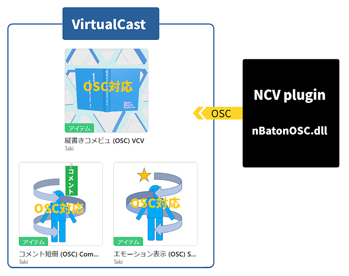

# nBatonOSC: NCV で受け取ったコメントや関連情報を OSC で転送するプラグイン
このプラグインを使用すると、 NCV (Niconama Comment Viewer) で受け取ったコメントや関連情報を VirtualCast に OSC (Open Sound Control) で送信できるようになります。  
  


## 必要環境
1. NCV version α223 以上  
   NCV の取得は[こちら (posite-c)](https://www.posite-c.com/) から行えます。  

## インストール
1. 「nBatonOSC.dll」をダウンロードするか、ソースからコンパイルします。  
2. 「nBatonOSC.dll」を右クリックし、プロパティのセキュリティ項目「許可する」にチェックを入れます。  
   手順: 右クリック→プロパティ→セキュリティ:このファイルは…☑許可する(K)  
3. 「nBatonOSC.dll」を NCV の `plugins` フォルダに置きます。  
   例: `C:\Program Files\posite-c\NiconamaCommentViewer\plugins`  
4. NCV を起動します。  
   NCV 起動後、設定ファイル「nBatonOSC.txt」が NCV の設定フォルダに自動的に作成されます。  
   設定ファイルに関して、ユーザー側で特別な作業は必要ありません。  
   (参考: 既定のフォルダは`C:\Users\%ユーザー名%\AppData\Roaming\posite-c\NiconamaCommentViewer` ですが、Windows の初期設定では隠しフォルダになっています。また、NCV のインストール先を変更している場合は異なるフォルダに作成される可能性があります。「UserSetting.xml」と同じフォルダに自動作成されます。)  

## アンインストール
1. 「nBatonOSC.dll」を削除します。  
   設定ファイル「nBatonOSC.txt」は上記の隠しフォルダ内にあります。削除できる方は手動で削除してください。  
   (参考: 設定ファイルは転送モードの数字「0」「1」「2」のいずれかを含むテキストファイルです。)  

## 使用方法
1. NCV のメニュー「プラグイン」から「nBatonOSC v0.0 設定 (Settings)」を選択します。  
2. 転送モードを選択し、設定画面を閉じます。設定画面を閉じると新しい設定が反映されます。  

## VirtualCastとの連携
1. VirtualCast のタイトル画面で「VCI」の中の「OSC受信機能」を「creator-only」または「enabled」に設定します。どちらを選ぶべきか不明な場合は、「creator-only」を選択して様子を見てみてください。  
   (参考: このプラグインでは VirtualCast の「OSC送信機能」は使用していません。)  
2. 「縦書きコメビュ (OSC) VCV」を [VirtualCastの商品のページ](https://virtualcast.jp/users/100215#products) から入手します。  

## プラグインの挙動
1. コメント関連情報の送信  
   コメントを受信した際、転送モードが「1:スタジオ[運営コメント]」または「2:ルーム[全コメント]」の時に、以下の形式で送信されます。  
   ```C#:Class1.cs
   UDPSender("127.0.0.1", 19100);  
   OscMessage("/vci/baton/comment", blob_comment, blob_name, str_commentSource, int_transferMode); 
   ```
2. 転送モードの送信  
   NCV の起動時、終了時、放送接続時、転送モード変更時に以下の形式で送信されます。  

   ```C#:Class1.cs
   UDPSender("127.0.0.1", 19100);  
   OscMessage("/vci/baton/mode", int_transferMode);  
   ```

## 引数の型及び具体例
ここでは OSC メッセージで使われる引数の型と具体例を紹介します。  
1. `/vci/baton/comment`, `/vci/baton/mode`  
   OSC メッセージの送信先や目的を識別するための OSC アドレスです。  

2. `blob_comment`  
   コメント (BlobAsUtf8 UTF-8 文字列を表すバイト列)  
   - Twitterの画像連携等でコメントが空白の時は「（本文なし）」  
   - コメントソースが NicoliveAd, NicoliveInfo, NicoliveGift, NicoliveSpi, NicoliveEmotion の場合は適宜編集（例: 「/nicoad」「/info *」「/gift」「/spi」「/emotion」を削除）  
   - その他、制御文字の全角変換等の編集

3. `blob_name`  
   ユーザー名 (BlobAsUtf8 UTF-8 文字列を表すバイト列)  
   - 運営コメントの場合は「（運営）」  
   - 生 ID または 184 で、固定ハンドルネーム(以下コテハン)が登録されている場合はそのコテハン  
   - コテハンが登録されていない生 ID の場合、ユーザー名が取得できればその名前、取得できなければ「（生ID）」  
   - コテハンが登録されていない 184 の場合、184 の ID  

4. `str_commentSource`  
   コメントソース (String ASCII 文字列)  
   - 一般コメント: Nicolive  
   - 184 コメント: Nicolive184  
   - 運営コメント(既定値): NicoliveOperator  
   - 特定の運営コメント: NicoliveAd、NicoliveInfo、NicoliveGift、NicoliveSpi、NicoliveEmotion  

5. `int_transferMode`  
   転送モード (Int32 32bit 整数)  
   - NCV 起動時は設定ファイルに保存されているモードの数字(「0」「1」「2」 のいずれか)  
   - 転送モード変更時はその新モードの数字  
    0: 転送しない  
    1: スタジオ[運営コメント]  
    2: ルーム[全コメント]  
   - NCV 終了時には「-1」を送信  

## VCI 側 main.lua の例
コメントの受信  
```lua:main.lua
function exampleComment(comment, senderName, senderCommentSource, mode)
  local isOperator = ((senderCommentSource == 'NicoliveOperator')
                   or (senderCommentSource == 'NicoliveAd') 
                   or (senderCommentSource == 'NicoliveInfo')
                   or (senderCommentSource == 'NicoliveGift') 
                   or (senderCommentSource == 'NicoliveSpi')
                   or (senderCommentSource == 'NicoliveEmotion'))
  if isOperator then
    print('運営コメント')
  end  
end  

-- OSC: コメント受信  
vci.osc.RegisterMethod('/vci/baton/comment', exampleComment, {vci.osc.types.BlobAsUtf8, vci.osc.types.BlobAsUtf8, vci.osc.types.String, vci.osc.types.Int32})  
```
これは VCI 側でコメントを受信するスクリプトの例です。関数 `exampleComment` は OSC で受信した 4 つの引数 (コメント、名前、コメントソース、転送モード) を受け取ります。コメントソースが「NicoliveOperator」や「NicoliveAd」等の時、デバッグコンソールに「運営コメント」と表示します。

転送モードの受信  
```lua:main.lua
function exampleMode(mode)
  if (mode == 0) then
    print("転送しない")
  end  
end  

-- OSC: 転送モード受信  
vci.osc.RegisterMethod('/vci/baton/mode', exampleMode, {vci.osc.types.Int32})  
```
これは VCI 側で転送モードを受信するスクリプトの例です。関数 `exampleMode` は OSC で受信した 1 つの引数 (転送モード) を受け取ります。転送モードが「0」の時、デバッグコンソールに「転送しない」と表示します。  

詳細については [バーチャルキャスト公式Wiki: ExportOsc(外部との OSC 通信)](https://wiki.virtualcast.jp/wiki/vci/script/reference/exportosc) をご覧ください。  

## ライセンス
このプログラムは MIT ライセンスのもとで公開されています。 

# nBatonOSC: A Plugin to Forward Comments and Related Information from NCV via OSC
This plugin allows you to send comments and related information received by NCV (Niconama Comment Viewer) to VirtualCast using OSC (Open Sound Control).  

  

## Requirements
1. NCV version α223 or later  
   You can obtain NCV [here (posite-c)](https://www.posite-c.com/).  

## Installation
1. Download `nBatonOSC.dll` or compile it from the source.  
2. Right-click on `nBatonOSC.dll`, go to Properties, and tick the checkbox named "Unblock" in Security.  
   Procedure: Right-click → Properties → Security: This file came... ☑ Unbloc<u>k</u>  
3. Place `nBatonOSC.dll` in the `plugins` folder of NCV.  
   Example: `C:\Program Files\posite-c\NiconamaCommentViewer\plugins`  
4. Start NCV.  
   After starting NCV, the configuration file `nBatonOSC.txt` will be automatically created in the NCV settings folder.  
   No additional user action is required for the configuration file.  
   (Note: The default folder is `C:\Users\%username%\AppData\Roaming\posite-c\NiconamaCommentViewer`, which is hidden by default in Windows. If you changed the NCV installation path, it might be created in a different folder. It will be created in the same folder as `UserSetting.xml`.)  

## Uninstallation
1. Delete `nBatonOSC.dll`.  
   The configuration file `nBatonOSC.txt` is located in the hidden folder mentioned above. If possible, delete it manually.  
   (Note: The configuration file is a text file containing a transfer mode number "0", "1", or "2".)  

## Usage
1. Select "nBatonOSC v0.0 Settings" from the NCV menu under "Plugins".  
2. Choose the transfer mode and close the settings window. The new settings will be applied when the settings window is closed.  

## Integration with VirtualCast
1. In the VirtualCast title screen, set the "OSC Receive Function" in the "VCI" section to either "creator-only" or "enabled". If you're unsure which to choose, select "creator-only" and check the results.  
   (Note: This plugin does not use the "OSC Send Function" of VirtualCast.)  
2. Obtain the "縦書きコメビュ (OSC) VCV" from [VirtualCast's products page](https://virtualcast.jp/users/100215#products).  

## Plugin Behavior
1. Sending Comments and Related Information  
   When a comment is received and the transfer mode is "1: Studio [Operator Comments]" or "2: Room [All comments]", it sends in the following format:  
   ```C#:Class1.cs
   UDPSender("127.0.0.1", 19100);  
   OscMessage("/vci/baton/comment", blob_comment, blob_name, str_commentSource, int_transferMode);  
   ```
2. Sending Transfer Mode  
   When NCV starts, stops, connects to a broadcast, or changes the transfer mode, it sends the following format:  
   ```C#:Class1.cs
   UDPSender("127.0.0.1", 19100);  
   OscMessage("/vci/baton/mode", `int_transferMode`);  
   ```
## Argument Types and Examples
This section introduces the types and examples of arguments used in OSC messages.  
1. `/vci/baton/comment`, `/vci/baton/mode`  
   OSC addresses used to identify the destination and purpose of OSC messages.  

2. `blob_comment`  
   Comment (BlobAsUtf8 byte sequence representing a UTF-8 string)  
   - When the comment is blank due to image integration on Twitter, it is "（No content）"  
   - For comment sources like NicoliveAd, NicoliveInfo, NicoliveGift, NicoliveSpi, or NicoliveEmotion, the comment would be edited as needed (e.g., remove "/nicoad", "/info *", "/gift", "/spi", "/emotion")  
   - Other edits such as full-width character conversion for control characters  
  
3. `blob_name`  
   Username (BlobAsUtf8 byte sequence representing a UTF-8 string)  
   - For operator comments, it is "（Operator）"  
   - For Raw IDs or 184 with registered fixed handle names (nicknames), it uses the nickname  
   - For Raw IDs without a registered nickname, if the username can be obtained, it is used; otherwise, it is "（Raw ID）"  
   - For 184 without a registered nickname, it uses the 184 ID  
  
4. `str_commentSource`  
   Comment Source (String ASCII string)  
   - General comments: Nicolive  
   - 184 comments: Nicolive184  
   - Operator comments (default): NicoliveOperator  
   - Specific operator comments: NicoliveAd, NicoliveInfo, NicoliveGift, NicoliveSpi, NicoliveEmotion  

5. `int_transferMode`  
   Transfer Mode (Int32 32-bit integer)  
   - At NCV startup, it is the mode number saved in the configuration file ("0", "1", or "2")   
   - On transfer mode change, it is the new mode number  
    0: Off
    1: Studio [Operator Comments]  
    2: Room [All comments]  
   - On NCV shutdown, it sends "-1" 

## Example `main.lua` for VCI
Receiving Comments  
```lua:main.lua
function exampleComment(comment, senderName, senderCommentSource, mode)
  local isOperator = ((senderCommentSource == 'NicoliveOperator')
                   or (senderCommentSource == 'NicoliveAd') 
                   or (senderCommentSource == 'NicoliveInfo')
                   or (senderCommentSource == 'NicoliveGift') 
                   or (senderCommentSource == 'NicoliveSpi')
                   or (senderCommentSource == 'NicoliveEmotion'))
  if isOperator then
    print('Operator comment')
  end  
end  

-- OSC: receive comment  
vci.osc.RegisterMethod('/vci/baton/comment', exampleComment, {vci.osc.types.BlobAsUtf8, vci.osc.types.BlobAsUtf8, vci.osc.types.String, vci.osc.types.Int32})  
```
This is an example script for receiving comments on the VCI side. The `exampleComment` function receives four arguments (comment, name, comment source, transfer mode) via OSC. It prints "Operator Comment" to the debug console if the comment source is "NicoliveOperator" or "NicoliveAd", etc.

Receiving Transfer Modes  
```lua:main.lua
function exampleMode(mode)
  if (mode == 0) then
    print("Off")
  end  
end  

-- OSC: receive transfer mode  
vci.osc.RegisterMethod('/vci/baton/mode', exampleMode, {vci.osc.types.Int32})  
```
This is an example script for receiving transfer modes on the VCI side. The `exampleMode` function receives one argument (transfer mode) via OSC. It prints "Do not transfer" to the debug console if the transfer mode is "0".  

For more details, please refer to the [VirtualCast Official Wiki: ExportOsc(外部との OSC 通信)](https://wiki.virtualcast.jp/wiki/vci/script/reference/exportosc)  

## License
This plugin is released under the MIT License.